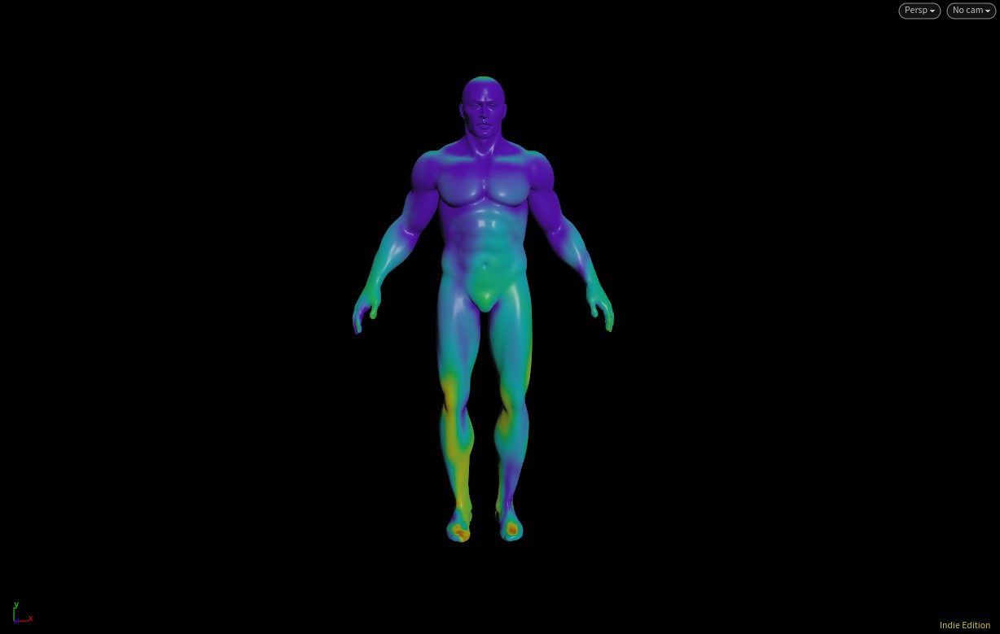
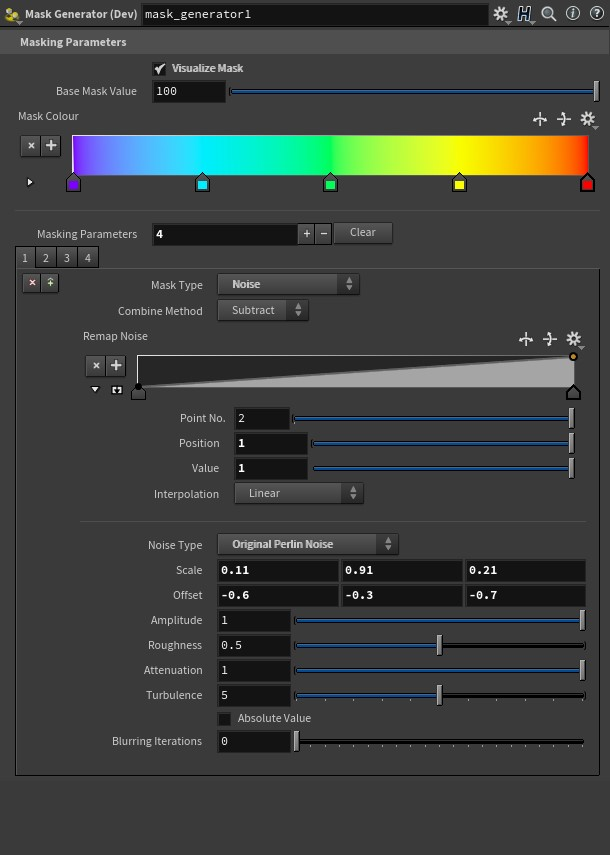
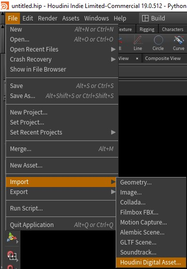
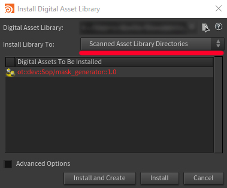

# **Houdini mask generator**

## Introduction
The Mask Generator tool is used to generate masks on the point level for geometry.
The tool generates Ambient Occlusion, Direction, Height, Noise and Slope masks.

These masks can be combined via multiparm instances and have various Combine Method options, such as Add, Sub, Mult, Div and so on.

**Example of a few the tool looks when used on Tommy.**

## **How to use the tool** 

### **Getting the tool**

To get the tool:
1. Go to the main tool page and download https://github.com/ognyan97/Houdini-Masking-Generator-/blob/main/sop_ot.dev.mask_generator.1.0.hdalc . 

2. Import it to your local Houdini HDA / OTL library. (this of course varies from user to user).
3. Open Houdini
4. Import the .HDALC file through FILE -> Import -> Houdini Digital Asset...

